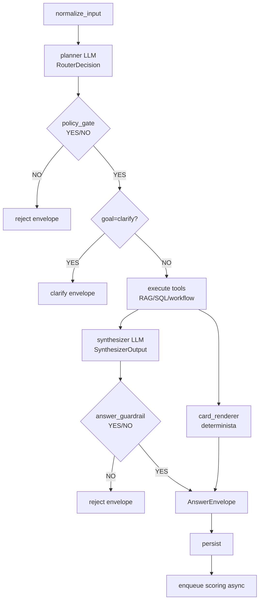

# Agent Core Diagrams (LangGraph)

## Flujo principal

```mermaid
flowchart TD
    A[normalize_input] --> B[planner LLM\nRouterDecision]
    B --> C{policy_gate\nYES/NO}
    C -- NO --> X[reject envelope]
    C -- YES --> D{goal=clarify?}
    D -- YES --> E[clarify envelope]
    D -- NO --> F[execute tools\nRAG/SQL/workflow]
    F --> G[card_renderer\ndeterminista]
    F --> H[synthesizer LLM\nSynthesizerOutput]
    H --> I{answer_guardrail\nYES/NO}
    I -- NO --> Y[reject envelope]
    I -- YES --> J[AnswerEnvelope]
    G --> J
    J --> K[persist]
    K --> L[enqueue scoring async]
```

## Separación por zonas

```mermaid
flowchart LR
    subgraph DB[Base de datos]
      P1[planner_system\nai_system_prompts core]
      P2[synthesizer_system\nai_system_prompts core]
      P3[tenant policy]
      P4[lead_ai_prompts\nstyle overlay only]
    end

    subgraph LLM[Zona LLM]
      L1[planner]
      L2[synthesizer]
    end

    subgraph DET[Runtime determinista]
      D1[policy gate]
      D2[tool executor]
      D3[sql translator]
      D4[card renderer]
      D5[answer guardrail]
    end

    subgraph CONTRACTS[Contratos tipados]
      C1[RouterDecision]
      C2[ToolCall]
      C3[ToolResult]
      C4[SynthesizerInput/Output]
      C5[AnswerEnvelope]
    end

    DB --> LLM
    LLM --> DET
    DET --> CONTRACTS
```
