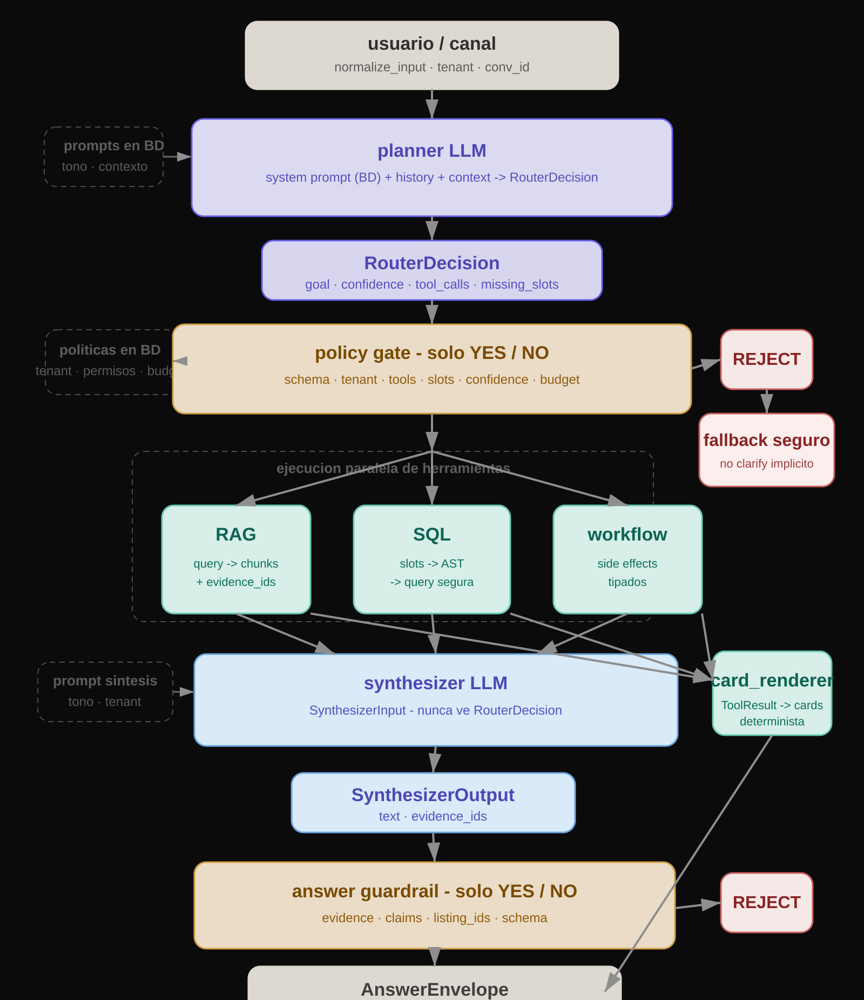
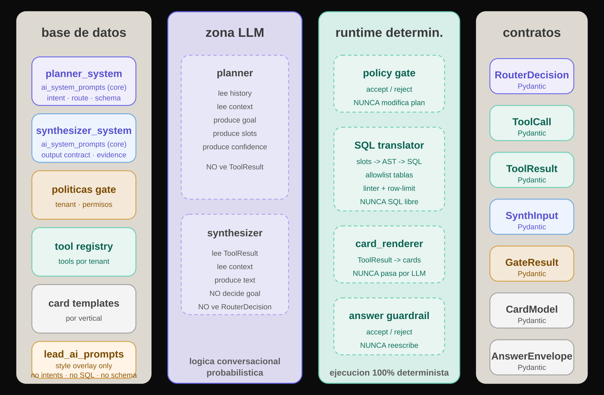

# Agent Core Diagrams

Documentacion visual del diseno propuesto para `agent-core`.

## Flujo End-to-End

## Separacion Por Zonas

## Nota

- `clarify` debe salir del planner como `goal`, no como efecto de `reject`.
- `gate` y `guardrail` solo aceptan o rechazan; no corrigen ni reescriben.
- `cards` se renderizan de forma determinista desde `ToolResult`.
